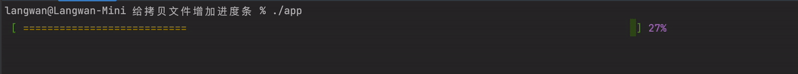

# 拷贝文件的彩色进度条



## 系统默认的 io.copy

代码

```go
package main

import (
	"fmt"
	"io"
	"os"
)

func main() {
	src, _ := os.Open("samples/1.mp4")
	dst, _ := os.Create("samples/2.mp4")
	nw, _ := io.Copy(dst, src)
	fmt.Printf("nw = %d\n", nw)
}
```

语言自带的 io.Copy 可以完成拷贝，但是不能提供进度条，所以我们要自己解决问题

## 带进度条的代码

代码

```go
package main

import (
	"fmt"
	"github.com/TwiN/go-color"
	"github.com/langwan/langgo/helpers/os"
	"math"
	"strings"
)

type Listener struct {
}

func (l Listener) ProgressChanged(event *helper_os.ProgressEvent) {
	if event.EventType == helper_os.TransferCompletedEvent {
		fmt.Println("\nfinish")
	} else {
		progress(float64(event.ConsumedBytes) / float64(event.TotalBytes) * 100.0)
	}

}

func main() {
	listener := Listener{}
	helper_os.CopyFileWatcher("samples/2.mp4", "samples/1.mp4", nil, &listener)
}

func progress(n float64) {
	number := int(math.Round(n))
	bar := strings.Repeat(" ", 100)
	bar = strings.Replace(bar, " ", "=", number)
	tag := fmt.Sprintf("%d%%", number)
	if number >= 100 {
		tag = "ok."
	}
	progress := fmt.Sprintf("%s [ %s%s%s ] %s%s\r", color.Green, color.Yellow, bar, color.Green, color.Purple, tag)
	fmt.Print(progress)
}
```


在 [langgo](https://github.com/langwan/langgo) 框架里我实现了一个 helper_os.CopyFileWatcher 方法，允许传入一个 helper_os.IOProgressListener 实例，当发生文件copy的时候会通过 ProgressChanged 回调进度

func CopyFileWatcher(dst string, src string, buf []byte, listener IOProgressListener) (written int64, err error)

dst - 目标文件

src - 原始文件

buf - 可以传 buf = nil 这时候内部会默认分配一个32K的 buf 实际上 io.Copy 内部也是32K，如果传入自定义buf会根据指定的大小来完成一次拷贝，但对于执行效率，没有决定性的影响，仅仅是影响回调的频率

listener - 需要自己实现一个 listener 用来回调进度

跑起来就是屏首的那个 GIF 动图的效果

## 实现

[langgo](https://github.com/langwan/langgo) 框架下的 CopyFileWatcher 代码

```go {linenos=table,hl_lines=[8,"15-17"],linenostart=1}
func CopyFileWatcher(dst string, src string, buf []byte, listener IOProgressListener) (written int64, err error) {
	var srcSize int64 = 0
	defer func() {
		if listener != nil {
			if err != nil {
				listener.ProgressChanged(&ProgressEvent{
					ConsumedBytes: written,
					TotalBytes:    srcSize,
					EventType:     TransferFailedEvent,
				})
			} else {
				listener.ProgressChanged(&ProgressEvent{
					ConsumedBytes: written,
					TotalBytes:    srcSize,
					EventType:     TransferCompletedEvent,
				})
			}
		}
	}()

	if buf == nil {
		size := 32 * 1024
		buf = make([]byte, size)
	}

	srcFile, err := os.Open(src)
	if err != nil {
		return written, fmt.Errorf("couldn't open source file: %s", err)
	}
	defer srcFile.Close()

	srcStat, err := srcFile.Stat()
	srcSize = srcStat.Size()
	if err != nil {
		return written, fmt.Errorf("source file stat: %s", err)
	}

	if listener != nil {
		listener.ProgressChanged(&ProgressEvent{
			ConsumedBytes: 0,
			TotalBytes:    srcSize,
			EventType:     TransferStartedEvent,
		})
	}

	dstFile, err := os.Create(dst)
	if err != nil {
		return written, fmt.Errorf("couldn't open dest file: %s", err)
	}
	defer dstFile.Close()

	for {
		nr, er := srcFile.Read(buf)
		if nr > 0 {
			nw, ew := dstFile.Write(buf[0:nr])
			if nw < 0 || nr < nw {
				nw = 0
				if ew == nil {
					ew = ErrInvalidWrite
				}
			}
			written += int64(nw)
			if ew != nil {
				err = ew
				break
			}
			if nr != nw {
				err = io.ErrShortWrite
				break
			}
		}
		if er != nil {
			if er != io.EOF {
				err = er
			}
			break
		}
		if listener != nil {
			listener.ProgressChanged(&ProgressEvent{
				ConsumedBytes: written,
				TotalBytes:    srcStat.Size(),
				EventType:     TransferDataEvent,
			})
		}
	}

	return written, err
}
```

代码 52-85 - 基本上是来自 io.copyBuffer 的源代码平移过来的，所以性能和表现是一样的，反复读反复写入，写入成功的时候回调进度

代码 3-19 - 当退出的时候根据 是否存在 err 来返回 TransferCompletedEvent 或者 TransferFailedEvent

代码 78-84 每次写入成功的时候推送进度条

代码 21-24 这个和 io.copyBuffer 是一致的 当 buf = nil 会自动创建一个 32 * 1024 的 buf 来提供读写缓存，提升 buf 大小只是影响 回调的频率，但对于花费的时间 影响不大

## 代码和视频

<https://github.com/langwan/chihuo/tree/main/go%E8%AF%AD%E8%A8%80/%E7%BB%99%E6%8B%B7%E8%B4%9D%E6%96%87%E4%BB%B6%E5%A2%9E%E5%8A%A0%E8%BF%9B%E5%BA%A6%E6%9D%A1>

<https://www.bilibili.com/video/BV1nt4y1u7pi/>